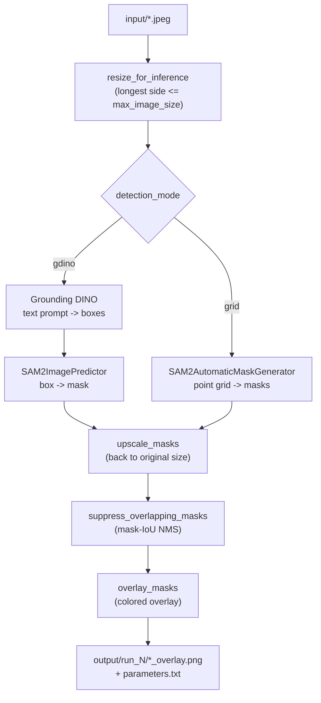

# Waste Detection Workaround (SAM 2 + Grounding DINO)

A CPU-only prototype for segmenting waste in photographs. It pairs Meta's
**SAM 2** segmentation model with **Grounding DINO** (referred to in project
notes as "dyno") for open-vocabulary detection, and it served as the
experimentation ground before the project moved toward optimising **SAM 3**.

> **Status: Abandoned / handoff.** This repository is no longer under active
> development. The two-stage SAM 2 + Grounding DINO approach worked as a
> baseline, but a better path was later identified in optimising SAM 3. The
> code and its run history are preserved here so a successor can reuse the
> scaffolding and continue the work. See [Wrap-up plan](#wrap-up-plan-for-the-successor).

---

## Goal of the repository

The original aim was to **optimise object detection and classification of
waste images** by combining SAM 2 with Grounding DINO ("dyno"):

- **Grounding DINO** turns a free-text prompt (for example, `construction
  waste.`) into bounding boxes for the objects of interest.
- **SAM 2** segments each detected box into a precise mask.

During the work a stronger direction was found in **optimising SAM 3**, which
is why active development on this combination stopped. This repository remains a
documented record of that exploration and a reusable CPU pipeline.

## Why this code is still relevant

- It is a **working CPU-only baseline** that runs end to end on commodity
  hardware with explicit memory budgeting.
- The **run history** under [`output/`](output/) captures real prompt and
  threshold tuning that a successor can learn from instead of repeating.
- The **CLI scaffolding** (resource checks, run-folder management, mask NMS,
  overlay rendering) is model-agnostic. The detection/segmentation backend can
  be swapped for a future SAM 3 implementation without rewriting the surrounding
  pipeline.

## Repository layout

- [`sam2_cpu_batch.py`](sam2_cpu_batch.py) - the single entry point; an
  interactive CPU batch driver for SAM 2 (+ Grounding DINO).
- [`automatic_mask_generator_example.ipynb`](automatic_mask_generator_example.ipynb) -
  reference notebook for SAM 2's automatic mask generator.
- `input/` - sample input images (`image00002.jpeg` … `image00020.jpeg`).
- `output/` - one `run_N/` folder per execution, holding overlay PNGs and a
  `parameters.txt` snapshot of the settings used.
- `sam2.1_hiera_tiny.pt`, `sam2.1_hiera_base_plus.pt`,
  `sam2.1_hiera_large.pt` - SAM 2.1 checkpoints already present on disk.
- `__pycache__/` - generated Python cache (safe to delete).

## High-level architecture and data flow



The script offers two active detection modes:

- **`gdino`** (default): Grounding DINO proposes boxes from a text prompt, then
  `SAM2ImagePredictor` segments each box.
- **`grid`**: `SAM2AutomaticMaskGenerator` segments using a dense point grid,
  with no text prompt.

A third mode, `florence2`, appears only in the legacy run logs
(`output/run_2/parameters.txt`, `output/run_3/parameters.txt`) and is no longer
present in the current script.

## Setup

This project does not ship a pinned dependency file (see
[Wrap-up plan](#wrap-up-plan-for-the-successor)). Based on the imports in
[`sam2_cpu_batch.py`](sam2_cpu_batch.py), the following are required:

- Python 3.10+ (the code uses PEP 604 `X | None` annotations)
- `torch`
- `opencv-python` (`cv2`)
- `numpy`
- `Pillow` (`PIL`)
- `transformers` (Grounding DINO via `AutoModelForZeroShotObjectDetection`)
- `psutil` (optional; used for the RAM pre-check, skipped if missing)
- `sam2` - Meta's [`segment-anything-2`](https://github.com/facebookresearch/sam2)
  package, which provides `sam2.build_sam`, `sam2.automatic_mask_generator`,
  and `sam2.sam2_image_predictor`
- `hydra-core` - required transitively by SAM 2's `build_sam2` config loading

**Checkpoints.** If a requested `*.pt` checkpoint is missing, `ensure_checkpoint`
downloads it from the URLs in `SAM2_CHECKPOINT_URLS`. The `tiny`, `base_plus`,
and `large` SAM 2.1 checkpoints are already present in this repository and will
be reused.

## Usage

Run the interactive driver from the repository root:

```bash
python sam2_cpu_batch.py
```

It reads every image in `input/`, prompts for parameters (press Enter to accept
the shown default), and writes results to a new `output/run_N/` folder.

The prompts are grouped as follows:

1. **Mode selection** - `detection_mode` (`grid` / `gdino`), default `gdino`.
2. **Shared SAM 2 parameters** - `model_cfg` (default
   `configs/sam2.1/sam2.1_hiera_b+.yaml`), `checkpoint_path` (default
   `sam2.1_hiera_base_plus.pt`), `max_image_size` (default `1024`),
   `overlay_alpha`, `overlay_random_seed`, `mask_nms_iou_threshold`.
3. **Mode-specific parameters**
   - `grid`: `points_per_side`, `pred_iou_thresh`, `stability_score_thresh`,
     `crop_n_layers`, `crop_n_points_downscale_factor`, `min_mask_region_area`.
   - `gdino`: `gdino_model` (default `IDEA-Research/grounding-dino-base`),
     `detection_prompt` (default `construction waste.`), `threshold`,
     `text_threshold`.
4. **Resource parameters** - `reserved_cpu_cores` (cores left for the OS),
   `max_ram_usage_fraction`.

### Reproducing the last tuned configuration

The most recent run (`output/run_9/parameters.txt`) used:

- `mode: gdino`
- `model_cfg: configs/sam2.1/sam2.1_hiera_b+.yaml`
- `checkpoint_path: sam2.1_hiera_base_plus.pt`
- `gdino_model: IDEA-Research/grounding-dino-base`
- `detection_prompt: construction waste. general waste. plastic tubes. wood. plastic.`
- `max_image_size: 2048`
- `threshold: 0.25`, `text_threshold: 0.1`

Enter these values at the corresponding prompts to reproduce that run.

## Output schema

Each execution creates `output/run_N/`, where `N` is the next available integer
(`next_run_dir` scans existing `run_<number>` folders and increments the max).
A run folder contains:

- `parameters.txt` - timestamp, image count, and every parameter used.
- `<image-stem>_overlay.png` - the input image with colored mask overlays, one
  per successfully processed input.

## Wrap-up plan for the successor

These are housekeeping tasks to finish the handoff. None of them change the
project's intent; they make the repository easier to adopt.

- [ ] **Make an initial git commit.** `git status` currently reports
  `No commits yet`; the working tree is entirely untracked.
- [ ] **Add a pinned dependency file** (`requirements.txt` or `pyproject.toml`)
  with the versions actually used.
- [ ] **Add a `.gitignore`** excluding `__pycache__/`, large `*.pt` checkpoints,
  and `output/run_*/`.
- [ ] **Document or remove the legacy `florence2` mode**, which survives only in
  `output/run_2` and `output/run_3` logs.
- [ ] **Decide how to store the large checkpoints** (`*.pt`): keep in-tree, move
  to Git LFS, or fetch on demand via `ensure_checkpoint`.
- [ ] **Capture ground-truth annotations** for the input images if any future
  quantitative evaluation is intended.

## Next steps and open questions for the successor

- **Migrate the detection/segmentation backend to SAM 3** once its API surface
  is settled, reusing the existing resource-budgeting and per-run logging
  scaffolding.
- **Build a labelled validation set** so prompt and threshold sweeps can be
  judged quantitatively rather than by eye.
- **Add a non-interactive mode** (config file or CLI flags) for batch/automated
  runs.
- Open question: `[FILL: which waste categories are in scope for the successor?]`
- Open question: `[FILL: target deployment environment (CPU only? GPU available?)]`

## Known limitations

- **CPU-only**; `hiera_large` in particular is slow on CPU.
- **No quantitative evaluation harness** and **no labelled ground truth** - all
  quality judgements so far are qualitative (visual inspection of overlays).
- **Prompt-sensitive**: results depend heavily on the `detection_prompt` and
  the detection thresholds, as the run history shows.

## Placeholders for the successor to fill

- `[FILL: repository URL]`
- `[FILL: maintainer / handoff contact]`
- `[FILL: license]`
- `[FILL: target deployment environment]`
